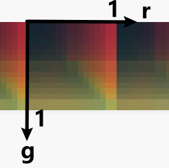
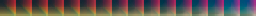
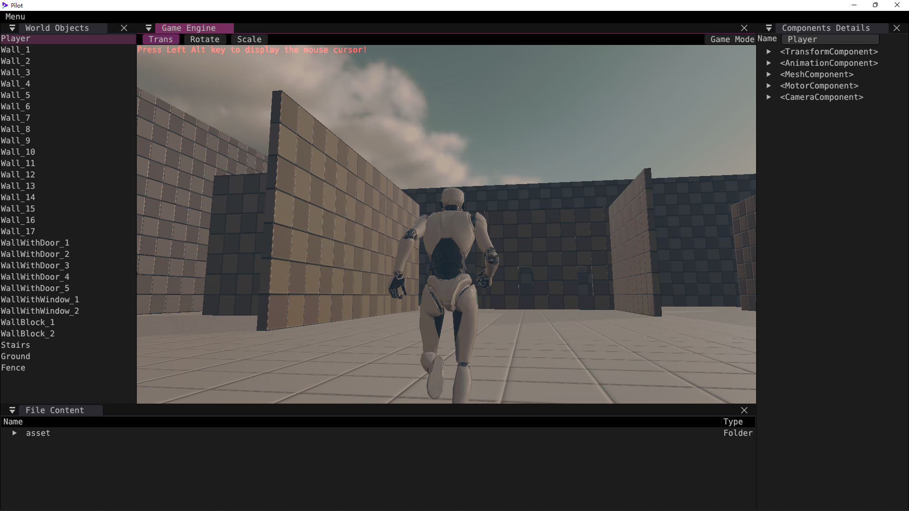

# GAMES104 作业 2 报告

KSkun

## Color Grading 实现

Color Grading 部分代码如下：

```glsl
#version 310 es

#extension GL_GOOGLE_include_directive : enable

#include "constants.h"

layout(input_attachment_index = 0, set = 0, binding = 0) uniform highp subpassInput in_color;

layout(set = 0, binding = 1) uniform sampler2D color_grading_lut_texture_sampler;

layout(location = 0) out highp vec4 out_color;

void main()
{
    highp ivec2 lut_tex_size = textureSize(color_grading_lut_texture_sampler, 0);
    highp float _COLORS      = float(lut_tex_size.y);

    highp vec4 color       = subpassLoad(in_color).rgba;

    // texture(color_grading_lut_texture_sampler, uv)
    highp float bLevel = floor(color.b * _COLORS);
    highp vec2 uv1 = vec2(color.r / _COLORS + bLevel / _COLORS, color.g);
    highp vec3 color1 = texture(color_grading_lut_texture_sampler, uv1).rgb;
    if (bLevel < _COLORS) {
        highp vec2 uv2 = vec2(color.r / _COLORS + (bLevel + 1.0) / _COLORS, color.g);
        highp vec3 color2 = texture(color_grading_lut_texture_sampler, uv2).rgb;
        color1 = mix(color1, color2, color.b * _COLORS - bLevel);
    }

    out_color = vec4(color1, color.a);
}
```

作业需要补充对 LUT 采样时计算 uv 的部分代码。由于 LUT 是三维贴图二维化的结果，其 v 方向尺寸 `_COLORS` 代表每个颜色的像素数，而 u 方向尺寸为 `_COLORS` 值的平方。对于每个尺寸为 `_COLORS` 的小块，其内部 uv 坐标就是 r 和 g 的值。



但 LUT 横向排列着 `_COLORS` 个不同 b 取值的 r-g 映射图，因此在每个图中 r 对应 u 坐标的 offset 应该为 `r / _COLORS`。

根据 b 取值确定对哪一幅 r-g 映射图采样更为复杂。首先需要通过 `floor(b * _COLORS)` 得到 b 取值对应的离散化级别 bLevel，对该级别的映射图采样（即 u 坐标为 `r / _COLORS + bLevel / _COLORS`）。如果级别不是最高级，则还需对高一级的映射图采样，再根据量化误差线性插值得到最终结果。

## 自定义 LUT



自定义 LUT 使用的如上图所示，可以发现，LUT 中的颜色相比纯色偏黄一些，这张 LUT 使得游戏画面泛黄，营造出一种历史记录的感觉。LUT 图文件为 `lukas_cygnus_lut.png`。



## 参考资料

- 自定义 LUT 来源
  https://www.youtube.com/watch?v=DNS0m4eb2sA
- LUT cube 文件转 png 工具
  https://github.com/dvjvp/LUT-to-UE4-clut/

